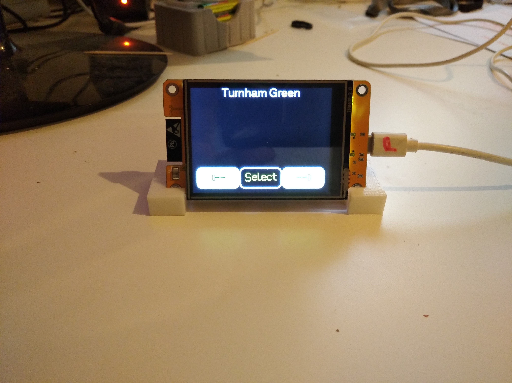
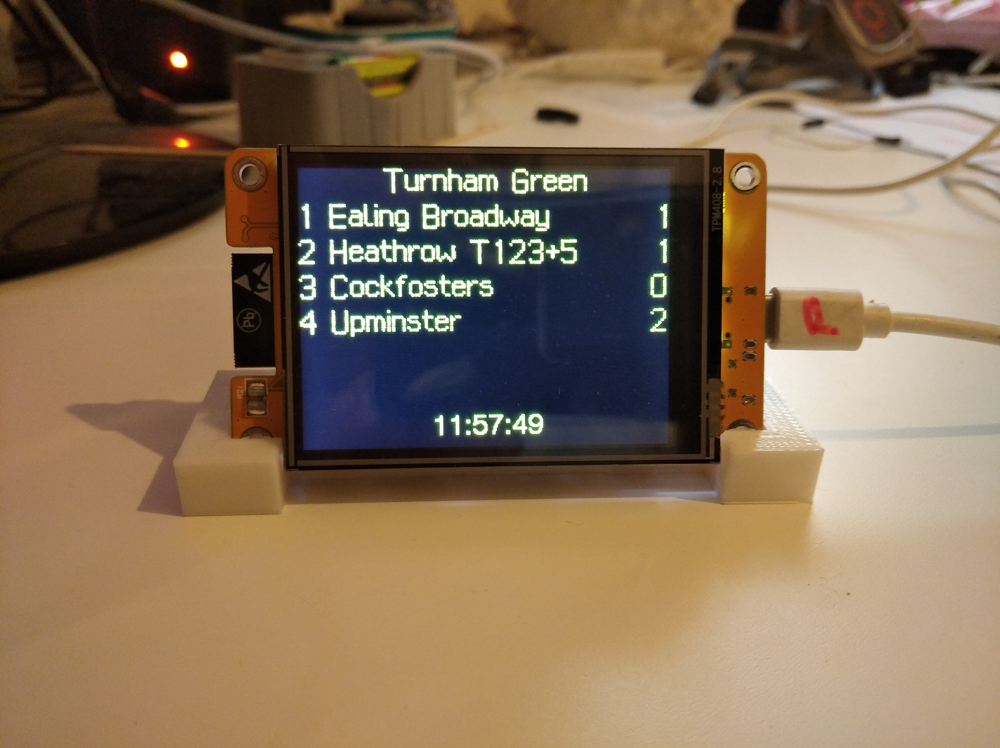
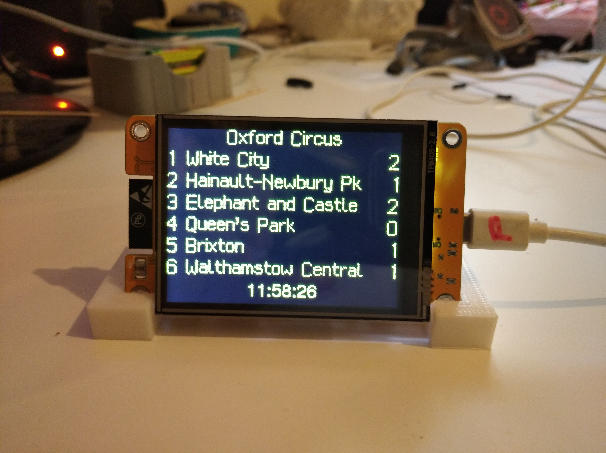

# Introduction
This projects retrieves publically available data from [Transport For London](https://api-portal.tfl.gov.uk/apis), parses the relevant data and displays it on a TFT screen.  
While my initial attempt was achieved quickly I soon realised that the correct approach would be to develop a generic application controlled by a configuration file. And this, I hope, is what I have achieved.  
No data is hard wired into the code, no wifi credentials, station ID's, screen sizes etc. All is contained in a JSON file stored externally to the code.  
My solution was developed on an ESP32 development board. These are widely available, provide WiFi connectivity, ample RAM and flash memory and cheap. It should be feasible to repeat this project on a similar board like Raspberry Pi Zero W or Pico W.  
My screen is an 240x320 TFT powered by an IL19341 chip. Your device may be different. Read the [TFT](#tft) section below.  
This project is a variation of my previous [LCD 2004A](https://github.com/mgaman/TFL-tube-arrivals-board-ESP32-Arduino) project. By swapping the LCD/Rotary Encoder/ESP32/External power supply with an integrated TFT/Touch/ESP32 setup I greatly simplified the process by eliminating all wiring and gaining more space to display information.
## Architecture
### main.cpp
Initialises the system and periodically accesses TFL to retrieve fresh data.
### wifi.cpp
Manages the WiFi connection to an access point. The configuration file may contain a number of WiFi SSID/password pairs of credentials and the code will pick that one suitable for the local access point.  
Also contains the code to connect to the NTP server to get the current time and update the current time, every second, on screen.
### jSonHandler.cpp
The configuration file <b>config.json</b> is read into memory. Part of the configuration contains an array of keys used to filter the incoming data from TFL. By filtering the data we greatly reduce the memory requirements of the application.  
Incoming data from TFL is read, filtered and the resulting JSON object processed prior to display.
### Item class
This class encapsulates the essential data of 1 arrival at a platform, its Platform number, Destination name, towards field and Time To Arrival.
### Process.cpp
The incoming data has 4 characteristics of interest, Destination, towards, Time of Arrival (expressed in seconds) and Platform Number.  
Becauses of the limitations of the display device one has to select which data that can be shown.  One line on screen has space for about 25 characters so I display platform number, destination and time to arrival (in minutes).  
JSON does not lend itself to sorting so my solution is to make an array of *List*. Each list contains instances of the *Item* class for a single platform. Each list is then sorted by *TimeToStation* and fed to the, final, display stage.
### Display.cpp
Display takes the top number of items in the list and sends them to the display device.  
Some compromises are in order. A line formatted as Platform Number, Destination and Arrival Time (in minutes) only has about 20 characters to show the Destination. Many destinations in the incoming data are much more verbose e.g. on the Elizabeth Line Heathrow Terminal 4 is shown as <b>Heathrow Terminal 4 Underground Station</b>. By using a substition table I replace that with <b>Heathrow T4</b>
## TFL API
The URL for getting a block of data (in JSON format) is https://api.tfl.gov.uk/StopPoint/910GACTONML/Arrivals where *910GACTONML* is the Station ID for Acton Town Main Line.  
To find the station ID for your station do a search https://api.tfl.gov.uk/StopPoint/Search/xxxxx where *xxxxx* is the name (or partial name) of what you are looking for. Note the search is case insensitive.  
Scan the returned JSON file for the ID you need. NOTE is the search term is not too specific you will get lots of irrelevant data e.g. you are looking for *Acton Main Line* a search on *acton* will return, amongst other stuff, every bus stop in Acton as well as the ID for Acton Main Line.
## Configuration
The configuration file *config.json* is comprised of the following sections
### WiFi
A list of key:value pairs where *key* is a known SSID and *value* the password to connect to that SSID
### stations
An array of station objects, each characterised by the following key:value pairs.
- Name   Displayed at the top of the screen. Also seen in the *station select* dialog.
- ID The ID of an TFL StopPoint e.g. *910GACTONML* for Acton Main Line.
- PlatformsToDisplay An integer array of which platforms to display from the arrival data.
- rowsPerPlatform How many rows of data per platform to be displayed.  The size of the *PlatformsToDisplay* array times *rowsPerPlatform* should not exceed the number of rows on the display device (6).
### defaultStation
The index (origin 0) of the station in the *stations* section to be displayed. If set to a number less than 0 then a screen is presented to select the station to be displayed. by pressing on the left and right buttons you can rotate through all the stations present in the *stations* section. When the desired station appears on the top line, click the *select* button.
### filterKeys
A list of keys for filtering incoming Arrivals data. You should familiarise yourself with the JSON structure of TFL API to understand this.  
Note that the Arrivals JSON data has 2 fields showing the destination name, *destinationName* and *towards*.  
At least one of *destinationName* and *towards* appears, sometimes both. If present I prefer to use *towards* as it gives a more accurate picture. For example the Picadilly Line to Heathrow shows *"destinationName":"Heathrow Terminal 2 & 3"* and *"towards":"Heathrow T123 + 5"* for the same train.
### server
The web address for TFL API.
### URL
The format for combining the server address and station ID for retrieving data for a particular station.
### refreshDelaySeconds
How often to request new data from TFL. Note that an occasional user does not need to request permission from TFL for access. A commercial user (> 500 request per minutes) needs to get an application key.
### substitutes
As mentioned before many destination names are too long to fit on the display. *substitutes* is an array of key:value pairs where *key* is the long destination name as seen in incoming data and *value* is a short name that conveys the same information and fits the available space. You may add new key:value pairs as necessary. Note this will affect the size of memory to be allocated for the config JSON object.
### TouchScreenPins
Applicable if you are using the TFT_Touch library.
### StandardColors
Defines the standard colors included in the TFT_eSPI library
### TEXT_FG_COLOR
### TEXT_FG_COLOR
### SCREEN_COLOR
Define the text foreground & background colors and the screen fill color. See the *StandardColors* section.
### logRawData
If true, writes all incoming JSON data to Serial.
### exportJson
If *true*, writes the contents of *config.json* to Serial. Note that this is the only real way of downloading the contents of the file.
### NTP_server
The URL of the server for getting the current time.
### DST
If *true* then current time is displayed is GMT+1, else GMT.

# First Time Use
After cloning the project, PlattormIO springs into action to do its magic. This includes loading all the necessary compilation tools used by the declared platform and libraries requested. The libraries have to modified to work for the project.  
Libraries are loaded to the path <b>Arrivals/.pio/libdeps/board_name</b>. In this project you will see from platform.io that *board_name* is *esp32dev*.  
Edit the *Arrivals/data/config.json* file to add the WiFi credentials of your Access Point. Upload to your device as described [here](#updating-the-configjson-file).
## TFT_eSPI
Here we are using the *TFT_eSPI* library from *https://github.com/Bodmer/TFT_eSPI*. Prior to using the library you have to tell which graphics chip is in use and how it is connected. This is done by editing the <b>Arrivals/.pio/libdeps/esp32dev/TFT_eSPI/User_Setup_Select.h</b> file and uncommenting the line appropriate to your hardware. For my board I had to create a new file in <b>Arrivals/.pio/libdeps/esp32dev/User_Setups/Setup400_IL19341_ESP32_HSPI.h</b> and reference it in <b>Arrivals/.pio/libdeps/esp32dev/TFT_eSPI/User_Setup_Select.h</b>.  
A copy of my file is in the <b>Arrivals/extras</b> folder.  
NOTE: My experience may not match your choice of board.
## List
After installing this library there is a *main.cpp* source file in <b>Arrivals/.pio/List/src</b> that must be eliminated as its compilation causes linkage problems. Either delete it or rename to *main.txt*
## TFT_Touch
This section is NOT applicable to a board where Touch is accessed via SPI. In that case you will need to replace all my touch oriented code by your own code.  
While the *TFT_eSPI* library contains support for a touch screen it is not applicable to my board as the touch sensor is not wired to be accessed via SPI. Accordingly I have added a facility to *config.json* for setting the numbers of the IO pins.  
Note the calibration line in *Display.cpp line 351*. Those values were determined by running the *TFT_Touch_Calibrate_v2* example in the library. You will need to do the same for your hardware.
# Compilation
This is a Visual Studio, Platform IO project where compilation options are contained in the *platformio.ini* file, section *build_flags*.  
- CONFIG_SIZE=nnn FILTER_SIZE=nnn DOC_SIZE=nnn. These affect memory allocated for JSON objects config,filter and doc. The default values here should suffice. The only time you probably need to make a change is for DOC. My default value of 4500 is sufficient for busy Oxford Circus with 6 platforms but there may be a station out there that needs more. To make an estimate get a block of JSON from a station and visit [here](https://arduinojson.org/v6/assistant/#/step1). This will give an indications of the space needed for unfiltered data. In my experience filtering reduces that by a factor of 8.
- ARDUINOJSON_ENABLE_COMMENTS The JSON standard does not allow embedded comments. ArduinoJSON handles embedded comments if this macro is defined.
- DEBUG Turn on general debugging data. Hopefully not needed.
# Updating the config.json file
The classic tool for reading and writing data between an ESP32 and computer is *esptool.py*, however this tool deals with blocks of flash and is not interested whether that block of flash is executable code or SPIFFS data.  
In Platform.IO *esptool.py* is encapsulated in a user friendly interface to make it easy to create an SPIFFS file system image and upload that image to the ESP32 (but not download it).  
To modify *config.json* and upload to the ESP32, first edit the file then click on the *PlatformIO* icon to the left of the screen. This displays a range of *Project Tasks*. Click on *Build Filesystem Image* to make a copy of the SPIFFS file system then click on *Upload File System Image* to copy, via USB, to the ESP32 device.  Note that any window currently engaging the USB Serial device must be closed first.
# Dependencies
I made use of the delightful [London Underground](https://github.com/petykowski/London-Underground-Dot-Matrix-Typeface) dot matrix font for displaying data. Note that one cannot use the ttf files directly. First they must be converted to a bitmap image via the convertor [here](https://rop.nl/truetype2gfx/).
# TFT
Choosing a TFT+Touch device is not for the faint-hearted. Sites like *AliExpress* offer dozens of options which probably all work well. However documentation is often sparse, if at all.  The device [I bought](https://www.aliexpress.us/item/3256805429758720.html?spm=a2g0o.order_list.order_list_main.29.2dd51802zkuPcO&gatewayAdapt=4itemAdapt) was an integrated ESP32/IL1934/XPT2046 device. While the IL19341 chip is supported by the TFT_eSPI library it is unusually wired to the ESP32 HSPI bus rather than the usual VSPI bus, so I needed to construct a configuration file. Next the XPT2046 is not wired to the SPI bus so I could not use TFT_eSPI Touch support. Instead I had to use TFT_Touch.  
# Issues 
- Refreshing data, if data is missing should I age previous data?  is that legitimate as is it no longer TFL data? 
- Platform numbers are expressed as verbose text e.g "Eastbound Platform 6". To extracting the number I skip all non-digits until arriving at the first digit and converting from there. So far this has worked without problems.  
- Time To Arrival is expressed in seconds, I convert this to minutes and round down.
- Screen Flicker. I tried to implement a TFT_sprite for 6 lines (180*320 pixels) of data to avoid clearing the entire screen but this caused memory allocation problems.
## ToDo
- add SD for config.json
- OTA to update file?
- Use wifi access point mode to get wifi credentials & store to json.
